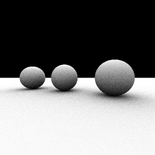

# AObench for Ante




## What is this

Ported [aobench](http://code.google.com/p/aobench/) program to Ante programming language.

> aobench is a small ambient occlusion renderer for benchmarking realworld floating point performance in various languages.

This program was tested with ante 0.1.1 ([#139cf8c](https://github.com/jfecher/ante/tree/139cf8ca80a6f2e5c5152e42c1d4a4b521c2592f)).

## Execute

To build the benchmark program, just type `make` in the project root directory.

```sh
make
./aobench
```

Then a file `aobench.ppm` is generated in the same directory.


## Performance comparison

The following results were obtained in the development environment:

|compiler  |time    |
|----------|--------|
|ante(dbg) |0m7.487s|
|ante(-O3) |0m2.431s|
|gcc(-O3)  |0m0.658s|
|clang(-O3)|0m0.675s|
|polyml    |0m4.745s|


Where the implementations for GCC and Poly/ML were taken from [eldesh/aobench_sml](https://github.com/eldesh/aobench_sml).

